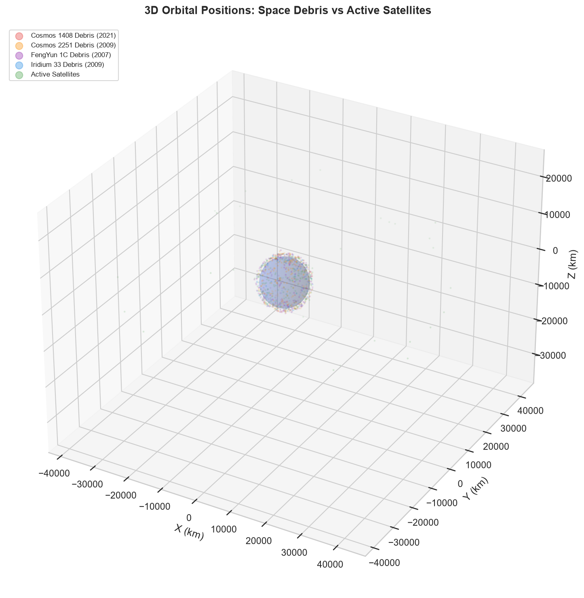

# 🛰️ Space Debris Detection & Temporal Validation

[](https://www.python.org/)
[](https://shuklajaya337.github.io/Space-debris-detection/)
[](#)

An end-to-end Machine Learning pipeline and interactive 3D telemetry dashboard designed to classify orbital objects as active satellites or space debris using raw Two-Line Element (TLE) datasets from **2024 (OLD_dataset)** and **2026 (26_Data set)**.

---

## 📌 Project Overview

Space debris poses an existential threat to active satellites, space stations, and future orbital missions. This project tackles two key challenges:
1. **Debris Detection**: Classification of active payloads versus fragmentation remnants using supervised Machine Learning.
2. **Temporal Validation**: Training on a 2024 epoch and validating on a 2026 epoch to demonstrate real-world generalization across time (cross-year accuracy).

### 🚀 Try the Live Interactive Web App
Explore the decision boundaries of the classifier by tweaking orbital sliders or loading actual satellite and debris presets:
👉 **[Live Demo on GitHub Pages](https://shuklajaya337.github.io/Space-debris-detection/)**

---

## 🏗️ Project Architecture

```
space-debris-detection/
│
├── OLD_dataset/                ← 2024 TLE Data Snapshots (Cosmos, FengYun, Iridium, Active)
├── 26_Data set/                ← 2026 TLE Data Snapshots (For temporal cross-year validation)
├── outputs/                    ← Directory containing generated plots & trained models
│   ├── 3d_orbit_visualization.png
│   ├── model_comparison.png
│   └── ...
│
├── Space_Debris_Complete.ipynb ← Primary Jupyter Notebook with the complete pipeline
├── detection.ipynb             ← Duplicate copy of the main notebook
├── index.html                  ← Web UI main dashboard page
├── style.css                   ← Dashboard futuristic telemetry styling
├── app.js                      ← Browser-based Decision Tree classifier logic
├── count_objects.py            ← TLE record validation and class counting
├── run_rf_accuracy.py          ← Standalone 2024 training and validation
├── cross_year_predict.py       ← 2024 -> 2026 temporal validation script
├── generate_outputs.py         ← Script to regenerate all 12 plots & models
├── run_web_app.py              ← Simple local web server launcher
└── verify_notebook.py          ← Notebook loadability verification utility
```

---

## ⚙️ Methodology & Pipeline Flow

### 1. Ingestion & SGP4 Feature Engineering
Using the **SGP4 (Simplified General Perturbations)** propagator, raw TLE strings are converted into a coordinate state vector ($X, Y, Z$) and velocity vector ($V_x, V_y, V_z$). From these, **14 physical orbital features** are derived, including specific orbital energy, altitude, eccentricity, perigee/apogee, and mean motion.

### 2. 3D Geocentric Orbital Mapping
The SGP4-propagated coordinates are rendered in a 3D coordinate frame around a translucent Earth model to show the physical distribution of debris clouds.



### 3. ML Modeling & Class Balancing
* Models trained: **Random Forest** and **Gradient Boosting**.
* Address class imbalance (80% satellites, 20% debris) using **SMOTE** (Synthetic Minority Over-sampling Technique) to ensure unbiased recall.

---

## 📈 Key Performance Metrics

### Model Performance (Accuracy)
| Model Classifier | 2024 Validation Accuracy | 2026 Temporal Validation Accuracy |
| :--- | :---: | :---: |
| **Random Forest** | `98.79%` | `99.11%` |
| **Gradient Boosting** | `99.32%` | `99.44%` |

### Per-Group 2026 Prediction Rates (% Classified as Debris)
| Group Category | Ground Truth | Random Forest Debris% | Gradient Boosting Debris% |
| :--- | :---: | :---: | :---: |
| **Cosmos 1408** | Debris | `50.00%` (2/4 objects) | `100.00%` (4/4 objects) |
| **Cosmos 2251** | Debris | `94.89%` | `100.00%` |
| **FengYun 1C** | Debris | `98.95%` | `98.37%` |
| **Iridium 33** | Debris | `83.33%` | `98.15%` |
| **Active Satellites** | Active Sat | `0.58%` (False Alarms) | `0.44%` (False Alarms) |

---

## 💻 How to Run & Check

To run the pipeline and check the code execution, run these commands inside the `space-debris-detection/` directory:

1. **Verify Raw Object Counts**:
   ```bash
   python count_objects.py
   ```
2. **Train and Validate Models (2024 data)**:
   ```bash
   python run_rf_accuracy.py
   ```
3. **Execute Temporal Cross-Year Predictions (2024 ➔ 2026)**:
   ```bash
   python cross_year_predict.py
   ```
4. **Regenerate All Output Plots**:
   ```bash
   python generate_outputs.py
   ```
5. **Run the Interactive Website Locally**:
   ```bash
   python run_web_app.py
   ```
   *Starts a local server and automatically opens `http://localhost:8000` in your web browser.*


